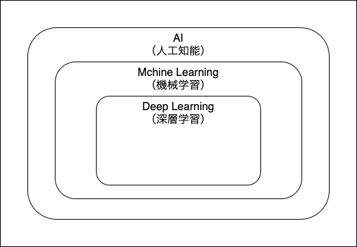

# 機械学習とは
トム・ミッチェルによる機械学習の定義
> 適切に提起された学習問題は以下のように定義される。 
> コンピュータ・プログラムは、ある課題Tについて、ある性能基準Pに基づき、  
> もしTについての性能が基準Pで測定して、経験Eと共に改善している場合に、  
> 経験Eから学習したと言うことが出来る。

具体例で言うと  
チェスのプレイに置いて（タスクT）、  
相手に勝つ確率（基準P）が1000回のチェスプレイ（経験E）によって高まれば、  
このプログラムは、1000回のチェスプレイの経験によって学習したことになる。

アーサー・サミュエルによる機械学習の定義
> コンピュータに明示的にプログラムすることなく学習する能力を与える研究分野

# AI・学習・深層学習の関係
