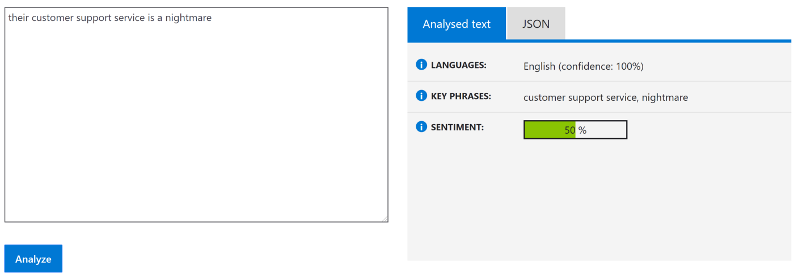
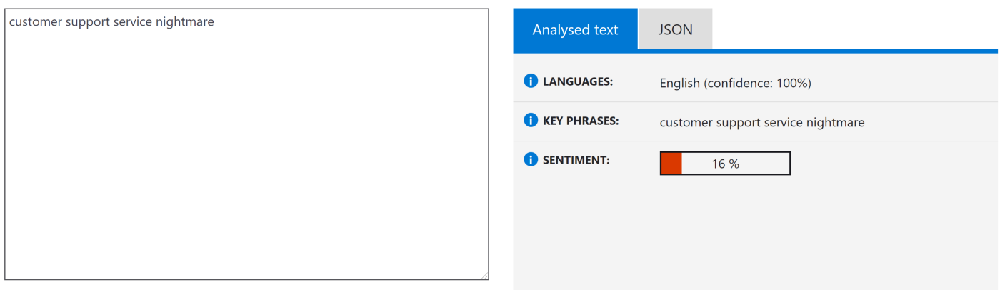

<!-- @import "[TOC]" {cmd="toc" depthFrom=1 depthTo=6 orderedList=false} -->

<!-- code_chunk_output -->

- [目標](#目標)
- [Introduction](#introduction)
- [Importance of Text Preprocessing](#importance-of-text-preprocessing)
- [General Outline of Text Preprocessing](#general-outline-of-text-preprocessing)
- [List of Text Preprocessing Steps](#list-of-text-preprocessing-steps)
  - [Remove HTML tags](#remove-html-tags)
  - [Convert Accented Characters](#convert-accented-characters)
  - [Expand Contractions](#expand-contractions)
  - [Treatment for Numbers](#treatment-for-numbers)
  - [Stopwords](#stopwords)
  - [Lemmatization](#lemmatization)
- [Everything Together Now and Next Steps](#everything-together-now-and-next-steps)

<!-- /code_chunk_output -->

# 目次 {ignore=true}

## 目標
[NLP Text Preprocessing: A Practical Guide and Template | by Jiahao Weng | Towards Data Science](https://towardsdatascience.com/nlp-text-preprocessing-a-practical-guide-and-template-d80874676e79)の要約をメモする

## Introduction
テキストの前処理は自然言語処理（NLP）タスクにとって重要なステップである。  
機械学習アルゴリズムのパフォーマンスを向上させるためにテキストを扱いやすい形式に変換する。

## Importance of Text Preprocessing
以下のような文は人間にはネガティブなレビューだと判別できるが機械では難しい。  
“their customer support service is a nightmare”  
訳：彼らのカスタマーサポートは悪夢です。  
実際に[Synapse Analytics | Microsoft Azure](https://azure.microsoft.com/en-in/services/cognitive-services/text-analytics/)にテキストを投げると50%という値が帰ってくる。  

ここからテキストに対して前処理、今回の場合は __stopwords__ （stopwordsについては後述）の除外を行う。  

このように適切な前処理を行えばNLPの機械学習の精度を上げることができる。

## General Outline of Text Preprocessing
テキストの前処理には一般的に３つの主要なコンポーネントがある。
- Tokenization（トークン化）
    テキストの文字列を小さな断片（トークン）に分割すること  
    段落→文、文→単語にトークン化できる  
- Normalization（正規化）
    テキストの正規化は文字種の統一（全て小文字に変換、全角と半角の統一）や表記ゆれの吸収など
- Noise removal（ノイズの除去）
    空白の削除など

さらに詳しくは[A General Approach to Preprocessing Text Data - KDnuggets](https://www.kdnuggets.com/2017/12/general-approach-preprocessing-text-data.html)を見てみる。

## List of Text Preprocessing Steps
一般的なテキストの前処理は以下のようなものになっている
1. Remove HTML tags
2. Remove extra whitespaces
3. Convert accented characters to ASCII characters
4. Expand contractions
5. Remove special characters
6. Lowercase all texts
7. Convert number words to numeric form
8. Remove numbers
9. Remove stopwords
10. Lemmatization

### Remove HTML tags
webスクレイピングなどで取得したテキストにHTMLのタグが含まれていることがあるのでNLPには不要なので削除する。
__BeautifulSoup__ を使用して以下のように書ける。

```python
def strip_html_tags(text):
    """remove html tags from text"""
    soup = BeautifulSoup(text, "html.parser")
    stripped_text = soup.get_text(separator=" ")
    return stripped_text
```

### Convert Accented Characters
“Would you like to have latté at our café?”  
NLPのタスクでは“latté”と“latte”は違う単語として扱われてしまうので同じ単語として扱うために変換する。  
例文は“latté”、“café”を“latte”、“cafe”に変換する。  
__unidecode__ モジュールを使用して以下のように書ける。

```python
def remove_accented_chars(text):
    """remove accented characters from text, e.g. café"""
    text = unidecode.unidecode(text)
    return text
```

### Expand Contractions
__don’t__ や __can’t__ を __do not__、 __can not__ に変換する。  
__contractions__ モジュールを使用して以下のように書ける。

```python
def expand_contractions(text):
    """expand shortened words, e.g. don't to do not"""
    text = contractions.fix(text)
    return text
```
この処理に関してはNLPのタスクによって使うか判断すること

### Treatment for Numbers
数字の扱いに関しては２つのステップがある  
- 文字で書かれている数字（例：三）を数値（例：3）に変換する  
__word2number__ モジュールを使用して以下のように書ける  
```python
text = """three cups of coffee"""
doc = nlp(text)
tokens = [w2n.word_to_num(token.text) if token.pos_ == 'NUM' else token for token in doc]

print(tokens) # result: [3, cups, of, coffee]
```

- 次のステップは数字の除外
数字の除外はタスクによって実行するか決める必要がある  
感情分析においては不要だが、チャットボットなどでチケットの枚数を抽出するときには必要

### Stopwords
__Stopwords__ とは非常に一般的な単語のことを指す。英語で言うと`we` `are` などのこと。  
このような非常に一般的な単語はNLPのタスク（感情分析やテキスト分類）において全く役に立たない。  
Stopwordsを削除することで計算時間と労力を削減できる。  
ただし、全てのStopwordsを削除するのではなくタスクに合わせることが重要。  
感情分析のタスクでは`no` `not`と言う単語が重要になるので削除しないなど。

### Lemmatization
__Lemmatization__ は単語を基本形に変換するプロセスのことを指す。  
__caring__ を __care__ に変換するなどのこと。  
__spaCy’s__ を使用したサンプルは以下のようになる。  

```python
text = """he kept eating while we are talking"""
doc = nlp(text)
# Lemmatizing each token
mytokens = [word.lemma_ if word.lemma_ != "-PRON-" else word.lower_ for word in doc]
print(mytokens) 
# result: ['he', 'keep', 'eat', 'while', 'we', 'be', 'talk']
```

単語の基本形を取得する別の方法として __stemming__ がある。  
処理速度に懸念がある場合はstemmingを検討してもOK。  
ただしstemmingは単語の終わりを切り落とす大まかな処理のため結果が適切でない可能性もあるので注意。  
例えば、__caring__ が __car__ に変換されてしまう。

## Everything Together Now and Next Steps
テキストの前処理が完了したらテキストを数値で表現できるようになる。  
主なものとしては、one-hot エンコーディングと単語の埋め込みベクトルとなっている。
また、テキストの前処理は深層学習においては悪影響を及ぼすと言及している専門家もいる。  
ただ、深層学習以外の手法では間違いなく重要な処理となっている。